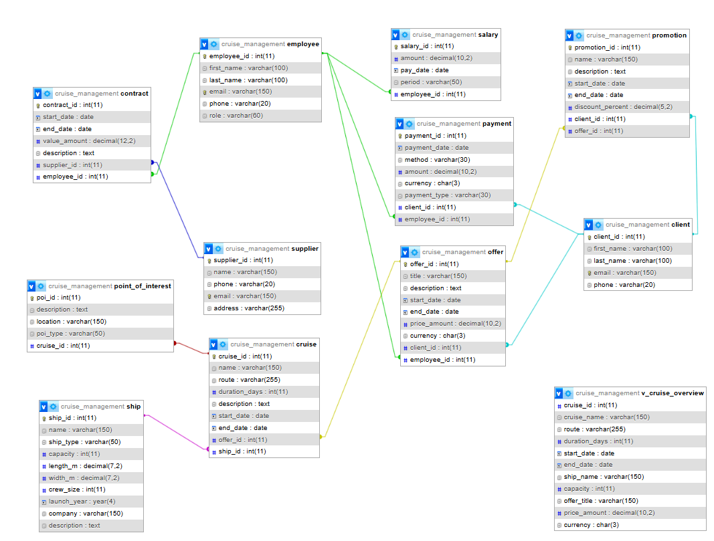

# 🚢 Cruise Management Database


A robust relational database system designed to manage the core operations of a cruise agency. This project covers cruise operations, fleet management, employee salary management, and supplier contracts using structured SQL best practices.


## 📋 Project Overview

This project simulates a backend database for a travel agency specializing in cruises. It was built to demonstrate proficiency in:
* **Data Integrity:** Implementing complex constraints (`CHECK`, `UNIQUE`, `FOREIGN KEY`).
* **Normalization:** Organizing data to reduce redundancy (3NF).
* **Reporting:** Using SQL aggregations and Views for business insights.

## 🗂️ Database Schema

Here is the Entity Relationship Diagram (ERD) showing the table relationships:



The database `cruise_management` consists of the following key entities:

* **Core:** `Client`, `Employee`, `Supplier`, `Ship`
* **Business Logic:** `Offer`, `Cruise`, `Payment`
* **Financials:** `Salary`, `Contract`, `Payment`
* **Marketing:** `Promotion`, `Point_of_Interest`

### Key Features
* **Automated Consistency:** `ON UPDATE CASCADE` and `ON DELETE SET NULL` rules ensure references remain valid.
* **Validation:** Dates are validated (End Date > Start Date) and amounts are checked for non-negativity at the database level.
* **Performance:** Indexes created on all foreign keys to optimize JOIN operations.

## 🚀 How to Run

1.  **Clone the repository:**
    ```bash
    git clone https://github.com/AnaDrobota/cruise-management-db.git
    ```

2.  **Import the Schema:**
    Open your SQL client (MySQL Workbench, DBeaver, phpMyAdmin) and run `01_schema.sql`.

3.  **Seed Data:**
    Run `02_seed.sql` to populate the tables with dummy data.

4.  **Test Queries:**
    Execute `03_queries.sql` to see the reports generated.

## 📊 Example Insights

The system can answer business questions such as:
* *Which ships have a capacity greater than 500 passengers?*
* *What is the total revenue generated per client?*
* *Which cruises are currently active or scheduled for next season?*

## 🛠️ Tech Stack
* **Database:** MySQL / MariaDB
* **Language:** SQL (Structured Query Language)

---
*Project developed for Database Systems Course - 2024*
